# Stored XSS
Tại **index.php** nhập nội dung vào và **submit** sẽ hiển thị nội dung ra bên ngoài màn hình.

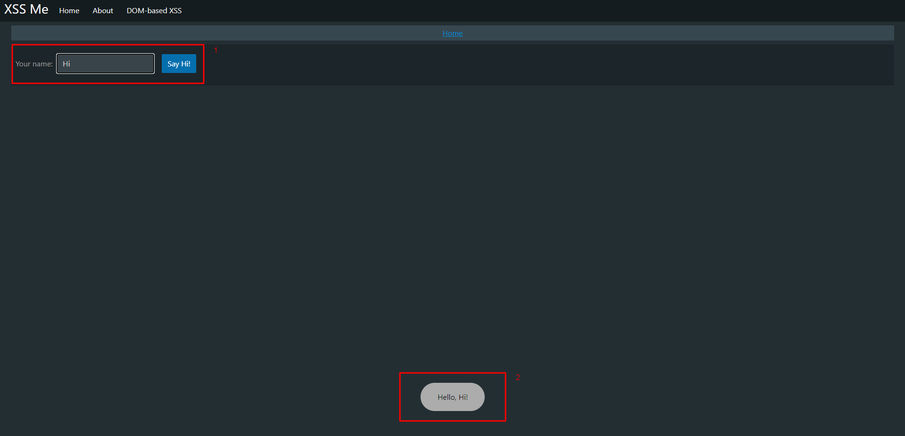

Với tính tò mò thì bắt đầu chèn thêm lệnh `` vào khung nhập, sau khi **submit** sẽ thấy hiện tượng kỳ lạ xảy ra.

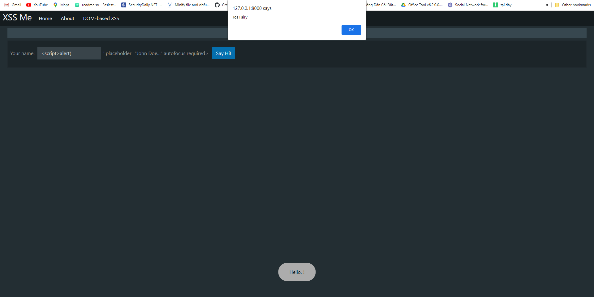

*Ài ố xì mà* vì tính tò mò không ngừng nên **view-source** lên xem cho rõ hơn.

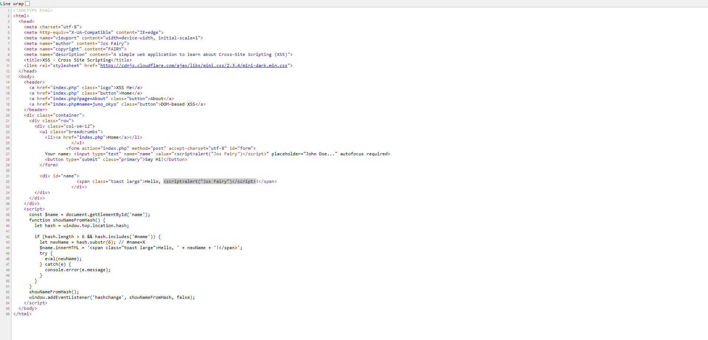

Ở trên, ta nhận ra rằng đoạn **script** không thực hiện ở khung nhập mà thực hiện ở khung hiển thị `id="name"`

# Reflected XSS
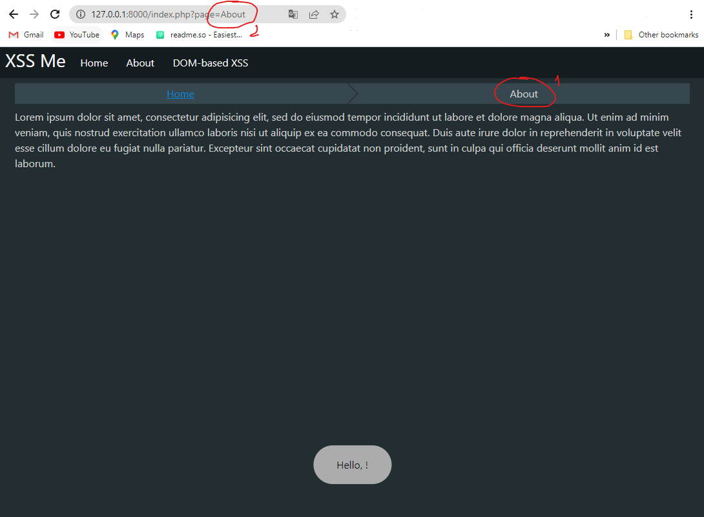

Ở trên, rõ ràng nhận thấy link page `page=About` chưa được mã hóa mà còn lộ HD Full không che nữa.

Để tiếp tục thực hiện hành vi của mình, thử chèn `123` vào đường dẫn xem có gì xảy ra không.

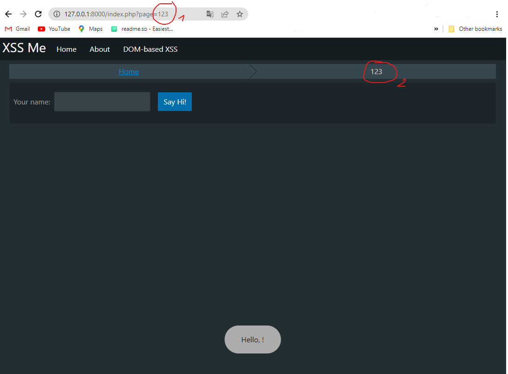

Ahihi! Vậy là xuất hiện một trang y hệt màn hình `index.php` rồi nhỉ?

Tương tự như **Stored XSS** ta chèn thêm đoạn `` để tấn công trang.

# DOM Base XSS
Với một trang web bình thường, luồng code hiển nhiên sẽ là nhập giá trị vào ô input sau đấy hiển thị ra màn hình. Tương tự trong bản demo này cũng vậy.

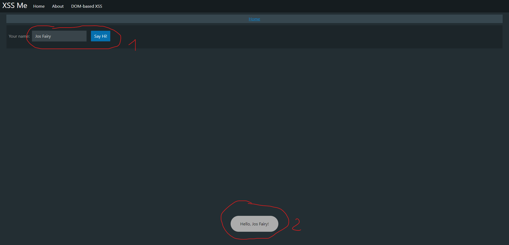

Nhưng khi `view-source` lên ta thấy `#name=josfairy` được bao bọc bởi hàm `eval()`

> Hàm **eval(string)** nhận biểu thức toán học hoặc câu lệnh javascript

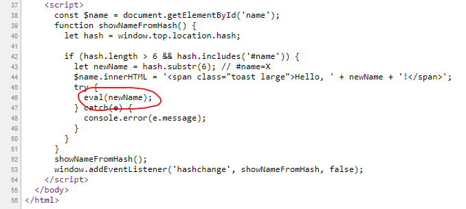

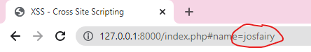

Vậy nên ta dễ dàng thao tác chỉ cần chèn câu lệnh `alert(1)` vào `#name=` là có thể tấn công.

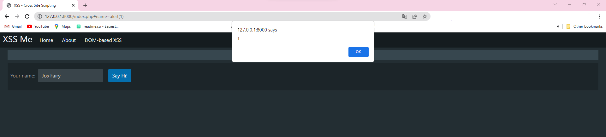

# Steal Cookies with XSS
Để thực hiện tấn công vào người dùng, những kẻ tấn công có thể thực hiện nhiều hành vi khác nhau để đưa ra mọi cách thức khác nhau chiếm lấy tài khoản người dùng.

Ở đây, mình dêo cách thức phổ biến mà hacker muốn chiếm lấy tài khoản của bạn bằng cách đánh cắp cookie.

Tại trang chủ `index.php`, chèn thêm đoạn mã script `` vào ô input

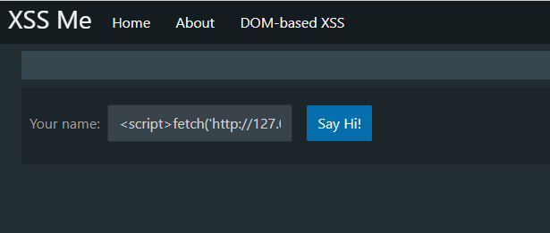

Sau khi **submit** lúc này đoạn script đã thực hiện và sinh ra một file `log.txt` chứa cookie của người dùng tương ứng.

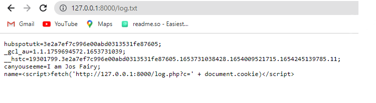

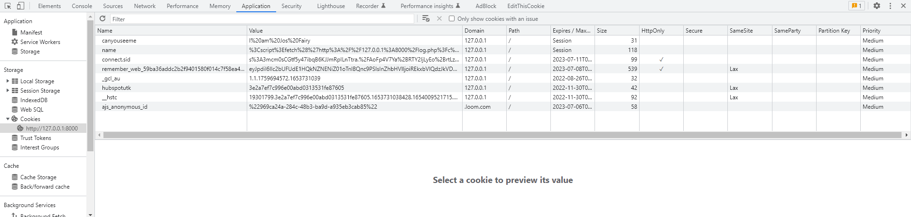